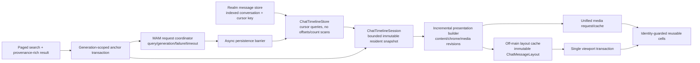

# ChatViewController: независимый аудит и Goal-план Telegram-level smoothness

Дата аудита: 2026-07-14

Аудируемая ветка: `feature/performance-fixes`

Аудируемый commit: `01699ee4c5406025807d179113bcedf8030dd551`

Статус: анализ текущего кода завершён; production-код в рамках аудита не изменялся.

## 1. Границы и метод аудита

Этот аудит выполнен заново по текущим исходникам. Прошлые аудиты, прежние backlog-файлы и старые Goal-планы не использовались как доказательство, источник выводов или шаблон списка задач.

В анализ вошли:

- открытие обычного чата на последнем сообщении;
- открытие на unread/saved/search anchor;
- локальная и MAM-подгрузка истории вверх и вниз;
- bounded/virtual timeline и сохранение viewport anchor;
- обработка Realm notifications, новых, изменённых и удалённых сообщений;
- optimistic outgoing и смена delivery/read/error state;
- UICollectionView apply, layout, scroll и inset corrections;
- построение display model, форматирование текста, markup, mentions, links и search highlight;
- image, video, location, contact/avatar, voice waveform и forwarded media;
- prefetch, reuse, cancellation и memory lifecycle;
- skeleton/bootstrap/loading states;
- маршрут `LastChatsViewController -> глобальный поиск -> результат сообщения -> ChatViewController`;
- exact/date MAM jump, persistence barrier, context loading, center и highlight;
- существующие unit/integration tests и sibling-worktree с текущей search-реализацией.

Данные тестового аккаунта намеренно не записаны в этот файл, git, scheme, shell history или логи. Live QA должен получать секреты только из защищённого окружения текущей сессии. Автоматический тест не имеет права удалять сообщения, которые он сам не создал и не записал в свой run manifest.

## 2. Главный вывод

Текущая реализация уже содержит полезное bounded resident window, background mapping и ряд generation guards, но масштабирование до 1 000 000 сообщений сейчас блокируют архитектурные обходные пути вокруг этого окна.

Наиболее критичный путь выглядит так:

1. `ChatViewController` подписывается на полный Realm `Results<MessageStorageItem>` всего диалога.
2. `ensureObserverLookupMaps()` при изменении signature перебирает весь `messagesObserver` и строит три словаря.
3. Этот метод вызывается не только для редких jump-операций, но и после первого видимого кадра, при scroll/read-boundary и в search context logic.
4. На 1 000 000 сообщений это O(N) main-thread work и память под миллионы dictionary entries, хотя UI показывает не более 1 250–1 500 resident rows.
5. После этого одна логическая операция нередко выполняет несколько `reloadData`, `layoutIfNeeded`, inset updates и `setContentOffset`, поэтому даже bounded snapshot может визуально дёргаться.

Следовательно, цель нельзя достичь одной настройкой page size, prefetch или animation. Нужны три системных изменения:

- единственным источником данных экрана должен стать bounded `ChatTimelineSession`, а не полный observer;
- каждое изменение UI должно применяться одной атомарной viewport transaction с максимум одним layout flush и одним offset mutation;
- layout/display/media должны вычисляться и кешироваться по immutable revision, а cell binding не должен выполнять Realm, disk I/O, full-resolution decode или повторную работу для unchanged content.

## 3. Что в текущем коде уже стоит сохранить

- `datasourcePageSize == 250`, первая локальная выборка ограничена 80 сообщениями: `ChatViewController.swift:34-40`.
- `ChatVirtualTimelineEngine` ограничивает resident window примерно 5–6 страницами: `ChatViewController+Dataset.swift:1601-1629`.
- обычный mapping выполняется на serial background queue, использует frozen Realm objects и generation check перед apply: `ChatViewController+Dataset.swift:8734-9092`.
- есть targeted inserts/deletes/moves и content-only classification: `ChatViewController+Dataset.swift:5922-6012`, `6977-7130`.
- реальные сообщения имеют стабильную UI identity по primary, имеются проверки duplicate primary/archive ID: `ChatViewController.swift:1663-1671`, `ChatViewController+Dataset.swift:33-96`.
- MAM final IQ сначала пытается завершить query-scoped persistence, затем разрешает anchor; порядок правильный, реализация barrier — нет.
- exact archive-ID jump предшествует ограниченному date fallback.
- image prefetch уже умеет рассчитывать target pixel size и downsample; это следует унифицировать с visible pipeline, а не удалять.
- avatar callback верхнеуровневого message cell имеет represented-identity guard.
- первый кадр и navigation mutation уже имеют отдельные policy-типы и signposts, которые можно превратить в проверяемый performance contract.

## 4. Карта критических проблем

| Приоритет | Проблема | Доказательство в текущем коде | Пользовательский эффект |
|---|---|---|---|
| P0 | Полный observer и три O(N) lookup-map | `ChatViewController.swift:4342-4352`; `ChatViewController+Dataset.swift:3738-3768`, `7270-7297`; вызовы из `ChatViewController.swift:5015-5027`, Dataset `7498-7519`, SearchBar `3801`, `3902` | зависание открытия/первого scroll, рост памяти пропорционально миллиону |
| P0 | Синхронный local page planning в scroll path | PrefetchDatasource `255-295`; Dataset `10391-10501` | hitch во время drag/deceleration |
| P0 | Query final persistence блокирует main | SearchBar `4495-4628`; Dataset `3221-3312`; `MessageManager+CommonReceiver.swift:825-924` | freeze при завершении MAM page/jump |
| P0 | Observer refresh remap’ит весь resident snapshot | Dataset `12146-12320`; `appendLiveMessage` существует только в `2614`, но не вызывается | задержка и cell churn на каждое новое/read/edit событие |
| P0 | Outgoing проходит через full reload и несколько bottom align | Dataset `5228-5241`, `6989-7008`, `6754-6762`; ChatVC `3810-3869` | подёргивание сразу после отправки |
| P0 | Apply делает несколько layout/inset/offset mutations | Dataset `6548-7130` | мерцание, двойная прокрутка, anchor drift |
| P0 | Layout cache выключен, sizing повторяется | `MessagesCollectionViewFlowLayout.swift:79-94`, `185-210`; `CommonMessageSizeCalculator.swift:293-522` | main-thread CoreText/boundingRect во время reload и scroll |
| P0 | First-frame mapping синхронен на main | Dataset `9549-9612` | время открытия зависит от сложности 80 сообщений |
| P0 | Prefetch и visible media используют разные request/cache keys | `ChatCollectionPrefetcher.swift:97-117`, `538-565`; `InlineImagesGridView.swift:171-245`; `InlineVideosGridView.swift:404-480` | повторный download/decode, full-resolution memory spike, flicker |
| P0 | Форматирование trim’ит body, но применяет исходные UTF-16 ranges | Dataset `839-910` и дублирующая ветка `243-315` | неверный markup либо `NSRangeException` |
| P0 | Forwarded media не имеет полного reuse/reset lifecycle | `InlineForwardsContainerView.swift:430-585` | старые view/tasks/timers, наложение медиа, рост памяти |
| P0 | Location prefetch не переиспользуется cell | `ChatCollectionPrefetcher.swift:689-710`; `ChatAttachmentGeolocationSource.swift:404-474`; `TextMessageCell.swift:123-184` | двойной snapshot, main-thread file decode, temp-file leak |
| P0 | Skeleton identity случайна, animation не останавливается | Dataset `9768-9816`; `SkeletonMessageCell.swift:24-63` | reload/flicker, накопление animations |
| P0 | Глобальный поиск материализует все совпадения на main | `SearchResultsViewController.swift:1221-1237`, `1296-1418`, `1645-1658` | зависание ввода/результатов на большой базе |
| P0 | Search result теряет message identity | `SearchResultsViewController.swift:89-124`, `860-883`, `1389-1418` | message без archive ID открывает latest либо не открывается; неверный date fallback |
| P0 | Anchor transaction не имеет generation/cancellation ownership | SearchBar `737-751`, `2033-2055`, `3016-3018`, `4040-4074` | stale A callback ломает более новый jump B |
| P0 | Position использует staged offset и fixed 0.35 s | SearchBar `3569-3659` | видимая лишняя прокрутка, premature highlight, drift после media relayout |
| P1 | Display cache меньше resident и имеет O(capacity) LRU | ChatVC `1815`; Dataset `1220-1320` | последовательный cache thrash, повторная глубокая сборка |
| P1 | State-only update полностью перебиндивает cell/media/avatar/waveform | Dataset `7022-7025`, `7104-7129`; `TextMessageCell.swift:783-907` | flicker и лишняя работа на receipt/read |
| P1 | Mapping jobs не отменяются кооперативно | Dataset `8734-9092`; ChatVC lifecycle `5094-5120`, `5492` | устаревшая работа блокирует актуальный snapshot |
| P1 | Debug trace eagerly строит hot-path payloads | многочисленные `ChatArchiveDebugTrace.log` в Dataset/SearchBar | Debug QA искажает производительность, возможна утечка identifiers |

## 5. Детальные выводы по подсистемам

### 5.1. Local history и индексирование

`ChatLocalHistoryPageProvider` ограничивает начальную выборку, но `boundedCandidateWindow()` сначала делает `scoped.count`, затем материализует 2× limit, а при недостаточном результате удваивает окно вплоть до `totalCount`: Dataset `1913-1953`. При большом bucket одинаковой даты, дублях или фильтрации worst case снова становится O(N).

`index(of:)` отдельно считает более ранние записи и полностью материализует bucket `date == boundary.date`. `item(at:)` использует глобальный integer offset. Эти API сохраняют зависимость от размера полной истории и не должны участвовать в интерактивном UI.

В Realm индексируются `owner`, `opponent`, `date`, `conversationType_`, `archivedId`, `messageId`, `deleteState_`, но основной фильтр использует неиндексированный `isDeleted`: `MessageStorageItem.swift:63-95`. Нет единого индексируемого conversation/timeline key и устойчивого tie-break key для одинаковых timestamp. Сначала нужно измерить реальные Realm query plans и migration cost, затем ввести схему, которая гарантирует cursor query без count/offset/full bucket.

### 5.2. Подгрузка вверх и вниз

Во время scroll `handleBoundaryPagingCandidate()` синхронно вызывает `makeInteractiveHistoryPagingPreparation()`, а та создаёт Realm provider, выполняет page query, sort/dedup/freeze и строит snapshot: Dataset `10391-10620`. Для moving state snapshot лишь откладывается до scroll rest, но тяжёлая подготовка уже произошла во время жеста.

В resting `.applyNow` подготовленный snapshot не переиспользуется: `performInteractiveHistoryPaging()` снова идёт через `loadDatasource`, то есть page может быть вычислена повторно. В `pageNewer()` дополнительно выполняются probe-запросы `limit: 1` для live edge и boundary cache. Нужен один async page plan -> один immutable result -> одна apply transaction.

Remote boundary loading временно меняет timeline placeholder и remap’ит/reload’ит resident, а после final remap’ит его ещё раз. Loader должен быть overlay/supplementary state, не fake message, влияющим на dataset geometry.

Имена `getPrevHistory`/`getNextHistory` исторически противоположны направлению UI: первый строит newer-page request, второй older-page request (`MessageArchiveManager.swift:2703-2793`). Это следует закрыть typed API `loadOlder(before:)`/`loadNewer(after:)` и тестовой direction matrix, а legacy names удалить.

### 5.3. MAM final IQ и archive coverage

`didReceiveEndPage` приходит на main, затем `ChatRemoteHistoryCompletionCoordinator.flushQueryMessages()` синхронно вызывает `storeMessagesNowSummary()`, который ждёт message queue и выполняет parse/reference preparation/Realm writes. Порядок persist-before-resolve обязателен, но ожидание не должно происходить на main.

Archive end/gap/cursor state должен подтверждаться query-scoped RSM и persistence proof, а не тем, какие строки сейчас resident. Один coordinator должен владеть query ID, direction, generation, timeout, failure, persistence barrier и terminal transition.

### 5.4. Первый кадр

`applyFirstFrameLocalHistoryIfNeeded()` синхронно на main:

- открывает Realm;
- делает local timeline query;
- freeze’ит rows;
- строит rich snapshots, references, PCM и attributed strings;
- вызывает full reload и layout.

Policy post-visible expansion сейчас намеренно выключена (`ChatFirstFrameLatestWarmupPolicy.shouldArm/shouldRun == false`), что хорошо. Однако deferred auxiliary refresh сразу после видимого кадра вызывает `refreshUnreadMentionsNavigatorState()`, который для обычного чата тоже вызывает `ensureObserverLookupMaps()`. Поэтому быстрый первый кадр может сменяться заметным зависанием сразу после появления.

Target open должен строить нужный bounded snapshot до первого content frame. Skeleton допустим только если target/context отсутствует локально и действительно ожидается сеть; валидную local history нельзя закрывать skeleton’ом.

### 5.5. Apply, viewport и scroll

`applyChatDatasource()` объединяет слишком много компенсирующих механизмов: reload/diff, layout invalidation, `layoutIfNeeded`, inset update, apply-phase anchor, fallback anchor, bottom alignment, default scroll, outgoing realignment и completion. Одна операция может менять offset несколько раз.

Optimistic outgoing специально выбирает immediate `reloadData`, делает layout/insets/align внутри reload block, затем `finish()` снова align’ит и планирует ещё один `DispatchQueue.main.async` align. Это прямой источник видимого рывка.

`reloadDataAndKeepOffset()` сохраняет offset через разницу `contentSize`, а не через `{message primary, viewport-relative minY}`. При edit, Dynamic Type, media correction или inset change такой метод не гарантирует сохранение сообщения на том же пикселе.

Scroll scheduler coalesce’ит работу, но один tick всё ещё может вызвать:

- synchronous boundary planning;
- полный observer-map rebuild;
- построение resident read models;
- recursive voice descriptor walk;
- floating date work.

Scroll hot path должен зависеть только от visible sections и заранее подготовленного resident metadata.

### 5.6. Новые сообщения, edit/delete и delivery state

Каждое debounced Realm изменение вызывает `didReceiveChangeset()`, которое снова получает current/latest resident snapshot, remap’ит его и применяет diff. `ChatVirtualTimelineEngine.appendLiveMessage()` существует, но production call отсутствует.

Нужен incremental change feed по stable primary/revision:

- tail insert near bottom -> один section insert и один bottom pin;
- tail insert away from bottom -> viewport неизменен, появляется new-message affordance;
- delivery/read/error -> chrome-only update;
- edit/reference/media change -> targeted content/layout invalidation;
- delete -> targeted delete с message-anchor preservation;
- live-tail trim -> удаление противоположного края в той же transaction.

### 5.7. Layout и display model

Size cache в `MessagesCollectionViewFlowLayout` закомментирован. Сначала calculator вычисляет size, затем `layoutAttributesForElements` снова вызывает `configure` и повторяет тяжёлую геометрию. Text path использует `boundingRect` и CoreText last-line analysis на main.

Существующий `MessageSizeCache` основан на `Set`, имеет linear lookup и не гарантирует replacement изменившегося размера. Нужен immutable `ChatMessageLayout` с O(1) lookup по ключу:

`primary + contentRevision + width + contentSizeCategory + locale + styleRevision + avatarMode`.

Display cache capacity 512 меньше resident 1 250–1 500. LRU использует `removeAll`/`removeFirst`, а глубокий reference snapshot, metadata copy, PCM parse и recursive hash строятся до cache hit. Delivery state входит в общий key, поэтому простой receipt инвалидирует rich content.

Конкретные correctness defects:

- `TextMessageCell` задаёт высоту label container из `textInlineViewSize.width`, а не `.height`: `TextMessageCell.swift:692-718`;
- `MessagesCollectionViewLayoutAttributes.isEqual` не сравнивает `forwardsInlineViewSize`: `MessagesCollectionViewLayoutAttributes.swift:63-135`.

### 5.8. Форматирование и interaction

Formatter создаёт строку из `body.trimmingCharacters(in: .newlines)`, но проверяет range против исходного `body.utf16.count` и применяет тот же range к более короткой строке. Leading/trailing newline делает валидный исходный range неправильным или out-of-bounds.

Markup/mention заменяют Dynamic Type font на hardcoded 14 pt. Подсвечивается только первое совпадение search query. Content signature сравнивает главным образом plain string и может не увидеть изменение link/markup при том же тексте.

`MessageLabel` не формирует tappable ranges из `.link` attributes, detector parsing закомментирован, а touch point передаётся без корректного coordinate conversion. В результате визуально форматированная ссылка/mention может не нажиматься либо нажиматься в неправильном месте.

Forward recursion и metadata должны иметь лимиты depth/node count/decoded bytes, чтобы malformed или намеренно глубокое сообщение не блокировало mapping/layout.

### 5.9. Медиа

Image/video prefetch и visible bind используют разные resource key/processor contract, поэтому processed prefetch cache не попадает в visible request. Visible cell может повторно декодировать original image. Video preview запускается заново при content reconfigure даже без смены preview URL.

`InlineForwardsContainerView.resetState()` не удаляет subviews, не чистит `contentViews`, не отменяет все async work/timers и не сбрасывает videos. Результат зависит от порядка `configure`/`apply`.

Location prefetch выбрасывает URL результата. Visible cell повторно создаёт snapshot и синхронно декодирует PNG через `UIImage(contentsOfFile:)` на main. Provider создаёт UUID temp file без общего bounded cache/cleanup.

Contact/avatar binding делает Realm/disk/fallback work при cell bind. Unchanged state update может сначала заменить avatar fallback’ом, затем снова загрузить тот же image.

Voice waveform повторно нормализует PCM, а playback timer каждые 50 ms запускает bitmap/path redraw. Static waveform и progress должны быть разделены.

### 5.10. Skeleton

Каждый skeleton mapping создаёт новые UUID primary/messageId и `Date.now`, поэтому identity/geometry нестабильны. Каждая configure запускает бесконечную UIView animation, `prepareForReuse()` её не удаляет, Reduce Motion не учитывается.

Нужен единый bootstrap reducer:

- `.localContent(snapshot)`;
- `.blockingTargetLoad(stableSkeletonDescriptor)`;
- `.empty`;
- `.failure(reason, retry)`.

Skeleton/loader не должен быть timeline row для boundary paging и не должен перезапускаться при повторном одинаковом state.

### 5.11. LastChats search -> конкретное сообщение

Глобальный local search выполняет `body CONTAINS[cd]`, материализует все совпадения через `.toArray()`, сортирует полный массив и выполняет дополнительные Realm lookup на main. Это не масштабируется до миллиона.

Result DTO хранит только часть identity. `SearchResultOpenRequestFactory` требует archive ID, выбрасывает primary/messageId/author/fingerprint и подставляет `Date()` при nil date. Message result без archive ID может молча привести к latest вместо целевого сообщения. Несколько результатов одного чата имеют одинаковый `diffId`.

Anchor execution state не generation-scoped. Новый request не отменяет все dispatcher/persistence/mapping/scroll callbacks старого. Уже существующий тест `testContextWaitingSearchRequestDoesNotCallPositioningStarted` падает: повторный request во время blocking context считает target готовым и вызывает `started/positioned`.

`positionMessage()` считает missing target успешным, делает staged offset, затем center scroll и завершает работу по fixed 0.35 s. Для перехода из LastChats это создаёт лишнюю видимую прокрутку и race с self-sizing/media.

Правильный контракт:

1. Result несёт immutable identity envelope: conversation, primary, archive ID, stanza/message ID, author, exact source date, normalized text fingerprint, provider/source, query generation.
2. Переход создаёт unique transaction token.
3. Local exact lookup выполняется индексированно без полного observer.
4. При local miss: exact archive request -> async persistence barrier -> exact retry.
5. Date fallback разрешён только при реальной source date и имеет bounded ambiguity policy; `Date()` запрещён.
6. Context window и proof coverage готовятся до первого content frame.
7. Применяется один snapshot и один center offset; target identity и tolerance проверяются после final layout.
8. Highlight применяется к тому же primary/revision; stale completion ничего не меняет.
9. Любой timeout/error/delete/supersession заканчивается typed terminal state и снимает locks/loaders.

## 6. Целевая архитектура



UI не должен знать total message count и не должен владеть объектом, перечисляющим всю историю. Миллион сообщений влияет на disk footprint и индекс B-tree, но не на число UI objects, dictionary entries, layout calculations или media requests.

## 7. Performance contract

Числовые timing/frame/memory thresholds ниже являются **provisional до завершения G00**. G00 измеряет baseline на зафиксированном hardware/OS/build и записывает calibrated значения. Детерминированные operation-count инварианты являются CI gates сразу; simulator wall-clock используется только как non-gating trend; frame/hitch thresholds становятся gating только на физическом reference device в Release.

### 7.1. Детерминированные CI-инварианты

- Ни один open/scroll/page/apply/search-jump path не перечисляет все сообщения диалога.
- Ни один интерактивный path не использует global `count`, integer offset или candidate expansion до N.
- Resident real-message rows не превышают выбранный hard limit; исходный ориентир — 1 500, итоговый лимит фиксируется тестом.
- First content frame строит только visible + bounded prefetch rows, а не весь resident rich layout.
- Один logical datasource update: максимум один **app-issued** forced layout flush и одна **app-issued programmatic** `contentOffset` mutation после готовности snapshot/layout. Gesture-driven и системные keyboard/self-sizing offset events учитываются отдельными counters и не маскируются как app mutations.
- Prepend/trim/edit сохраняет `{anchor primary, viewport-relative minY}` с ошибкой не более 1 pt.
- Chrome-only update не вызывает media/avatar/waveform requests и не меняет layout.
- Prefetch -> visible использует один request key и не увеличивает download/decode counter.
- Stale generation callback не меняет datasource, loader, offset или highlight.
- После teardown нет активных MAM dispatcher, timers, mapping jobs, prefetch ownership и cell media tasks.

### 7.2. Release hardware budgets и simulator trends

Пороговые значения сначала калибруются на фиксированном физическом reference device, OS и Release build; затем становятся hardware regression gate. Simulator публикует те же метрики только как trend и не проверяет 120 Hz/frame thresholds.

- Разница p95 `open request -> first stable content` между 100 и 1 000 000 persisted rows: не более 10% и не более 50 ms absolute.
- Provisional target: zero main-thread stalls >100 ms при open, bidirectional paging, send и search jump.
- Provisional hardware target: warm scripted scroll имеет zero frames >33 ms и hitch time ratio <1%.
- Hardware only: на 60 Hz provisional p95 frame time <=16.67 ms; на 120 Hz provisional p95 <=8.33 ms.
- Search result -> stable centered target p95 измеряется отдельно для local hit и one-page remote hit.
- Viewport anchor drift <=1 pt после prepend, trim и media completion.
- После 5-го из 20 одинаковых paging cycles resident memory растёт не более чем на 10%; active task/timer counts возвращаются к baseline.
- Optimistic text send -> local row p95 <=100 ms без `reloadData`.

Wall-clock пороги не заменяют operation-count tests: simulator timing нестабилен, а отсутствие O(N) должно доказываться счётчиками операций.

## 8. Текущая тестовая baseline

Для аудита создан и загружен отдельный симулятор `Xabber Chat Audit 2026-07-14`, iPhone 17 Pro, iOS 26.0, UDID `C53A77CA-E9F1-4538-954B-6E987143C843`.

Безопасный hosted run выполнялся одновременно с:

```bash
TEST_RUNNER_XABBER_DISABLE_ACCOUNT_AUTOCONNECT=1
TEST_RUNNER_XABBER_ISOLATED_STORAGE=1
```

Результаты:

- 156 сфокусированных tests из history/window/scroll/read/prefetch/mapping/cache/reuse/search/LastChats suites: 156 passed, 0 failed.
- расширенная выборка: 197 tests, 194 passed, 3 failed test methods;
- релевантное падение: `ChatMessageAnchorPolicyTests/testContextWaitingSearchRequestDoesNotCallPositioningStarted` — фактически получено `started, positioned` вместо отсутствия hooks;
- два остальных падения находятся в `LastChatsSeparatorAppearanceTests` и относятся к bottom-search/navigation appearance; их нужно отдельно стабилизировать, но нельзя маскировать изменениями timeline;
- повторный изолированный rerun сначала был отменён из-за shared DerivedData lock, поскольку sibling goal одновременно запускал `xcodebuild`. После освобождения cache тест был повторён отдельно и снова воспроизвёл обе ошибки: hooks получили `started, positioned`, а `pendingOpenMessageRequest` преждевременно стал `nil`. Это подтверждённый product failure; database lock был отдельной инфраструктурной коллизией.

### 8.1. Точный known-red ledger

Known-red не считается успешным тестом и не может бессрочно скрываться. До owner task runner обязан запускать selector отдельно и проверять, что он падает с той же сигнатурой; любое другое падение — новый blocker. Owner task сначала фиксирует red, затем делает test green и удаляет skip/ledger entry в том же commit.

| Exact selector | Текущая сигнатура | Owner/sunset task |
|---|---|---|
| `xabberTests/ChatMessageAnchorPolicyTests/testContextWaitingSearchRequestDoesNotCallPositioningStarted` | hooks равны `started, positioned`; pending request равен `nil` | G18 |
| `xabberTests/LastChatsSeparatorAppearanceTests/testLastChatsBottomSearchExpandsFullWidthAndHidesFloatingBottomBar` | appearance assertion failure | G17B |
| `xabberTests/LastChatsSeparatorAppearanceTests/testUpdateBottomTitleDoesNotMutateNavigationItemDuringOrAfterTransition` | navigation-item assertion failure | G17B |

Следующие Goal-прогоны обязаны использовать отдельный cache root, чтобы не влиять на соседний worktree:

```bash
export XABBER_XCODE_CACHE_ROOT="$HOME/Library/Caches/XabberCodex/xabber-chat-performance-goal"
export XABBER_SCHEME='Debug (xabber Workspace)'
export XABBER_DESTINATION='platform=iOS Simulator,id=<DEDICATED_SIMULATOR_UDID>'
export TEST_RUNNER_XABBER_DISABLE_ACCOUNT_AUTOCONNECT=1
export TEST_RUNNER_XABBER_ISOLATED_STORAGE=1
```

## 9. Обязательный протокол выполнения каждой задачи

Этот протокол применяется ко всем **24 отдельным задачам** последовательности G00–G20, включая G05A/G05B, G13A/G13B и G17A/G17B, без исключений.

1. Проверить `git status --short`, текущий HEAD и отсутствие чужих staged changes.
2. Обновить task/vault note и отметить задачу `in-progress`.
3. **До первого изменения файла** запустить указанный в задаче preflight test set на dedicated simulator и dedicated cache root.
4. Записать command, passed/failed/skipped и первый meaningful failure. Новый неожиданный baseline failure блокирует редактирование, пока не локализован. Документированное красное поведение можно исправлять только в задаче, которой оно принадлежит.
5. Добавить/изменить task-specific XCTest до production-кода; получить ожидаемый red result, если текущая реализация позволяет безопасно воспроизвести дефект.
6. Реализовать минимальный законченный slice. Не смешивать соседнюю задачу и не добавлять third-party dependency.
7. Запустить task-specific tests, затем общий chat smoke pack, затем simulator build через `tools/xcodebuild_cached.sh`; routine `clean` запрещён.
8. Проверить operation counters/performance budgets, leaks/tasks/timers там, где они относятся к задаче.
9. Обновить vault notes/decisions/docs и task note с фактической verification.
10. Удалить disposable `.xcresult`/logs конкретного прогона, если они не нужны для handoff; cache directories не удалять.
11. Stage только файлы задачи и сделать один focused commit с указанным либо эквивалентным message.
12. Проверить clean worktree после commit. Следующую задачу не начинать до успешного commit текущей.

G00 создаёт и коммитит исполняемый `tools/run_chat_goal_tests.sh` и versioned manifest селекторов. После G00 все команды ниже обязательны буквально:

```bash
tools/run_chat_goal_tests.sh preflight <TASK_ID>
tools/run_chat_goal_tests.sh focused <TASK_ID>
tools/run_chat_goal_tests.sh smoke <TASK_ID>
tools/run_chat_goal_tests.sh build <TASK_ID>
```

Runner обязан печатать HEAD, simulator UDID, cache root, exact selectors, skips и итог. Manifest хранит для каждого task ID concrete `-only-testing` selectors, exact known-red skips и owner/sunset. До G18 green smoke исключает только один exact anchor method через `-skip-testing`; весь остальной `ChatMessageAnchorPolicyTests` остаётся обязательным. До G17B два exact LastChats appearance methods запускаются как known-red. G17B/G18 удаляют соответствующие skips. Названия будущих тестовых файлов не могут использоваться как preflight до их добавления.

Минимальный общий smoke pack после каждой реализации:

- `ChatLocalHistoryPageProviderWindowingTests`
- `ChatVirtualTimelineEngineTests`
- `ChatDatasourceBoundsTests`
- `ChatScrollCoalescingTests`
- `ChatViewportReadBoundaryTests`
- `ChatDatasourceMappingThreadingTests`
- `ChatReloadInvalidationPolicyTests`
- `ChatDisplayModelCacheTests`
- `TextMessageCellReuseTests`
- `ChatMessageAnchorPolicyTests`, кроме exact known-red method до G18
- `ChatSearchSessionStateTests`
- `LastChatsViewControllerBehaviorTests`

## 10. Задачи для Goal-режима

### G00. Performance lab, fixtures и проверяемые budgets

**Цель:** до рефакторинга создать измерительную систему, которая отличает реальное устранение O(N) и render churn от субъективной плавности.

**Preflight до изменений:** до появления runner выполнить literal baseline command ниже; менять selectors или добавлять skip запрещено.

```bash
XABBER_XCODE_CACHE_ROOT="$HOME/Library/Caches/XabberCodex/xabber-chat-performance-goal" \
TEST_RUNNER_XABBER_DISABLE_ACCOUNT_AUTOCONNECT=1 \
TEST_RUNNER_XABBER_ISOLATED_STORAGE=1 \
XABBER_SCHEME='Debug (xabber Workspace)' \
XABBER_DESTINATION='platform=iOS Simulator,id=<DEDICATED_SIMULATOR_UDID>' \
tools/xcodebuild_cached.sh test -parallel-testing-enabled NO \
  -only-testing:xabberTests/ChatLocalHistoryPageProviderWindowingTests \
  -only-testing:xabberTests/ChatTimelineCursorTests \
  -only-testing:xabberTests/ChatDatasourceBoundsTests \
  -only-testing:xabberTests/ChatScrollCoalescingTests \
  -only-testing:xabberTests/ChatScrollBoundaryCacheTests \
  -only-testing:xabberTests/ChatViewportReadBoundaryTests \
  -only-testing:xabberTests/ChatCollectionPrefetchTests \
  -only-testing:xabberTests/ChatDatasourceMappingThreadingTests \
  -only-testing:xabberTests/ChatReloadInvalidationPolicyTests \
  -only-testing:xabberTests/ChatDisplayModelCacheTests \
  -only-testing:xabberTests/ChatPerformanceSignpostTests \
  -only-testing:xabberTests/ChatVirtualTimelineEngineTests \
  -only-testing:xabberTests/ChatBottomScrollAlignmentPolicyTests \
  -only-testing:xabberTests/ChatInitialHistoryAppearancePolicyTests \
  -only-testing:xabberTests/TextMessageCellReuseTests \
  -only-testing:xabberTests/ChatSearchPresentationStateTests \
  -only-testing:xabberTests/ChatSearchResultPresentationTests \
  -only-testing:xabberTests/ChatSearchSessionStateTests \
  -only-testing:xabberTests/LastChatsViewControllerBehaviorTests
```

**Работы:**

- добавить генератор persisted fixtures 100 / 10 000 / 100 000 / 1 000 000 thin rows без выделения миллиона rich UI models;
- добавить отдельный representative rich fixture: short/long text, UTF-16 markup, forwards, 1–5 images, video, location, contact, voice, edit/read/error;
- ввести privacy-safe counters: rows enumerated, candidates materialized, rich snapshots built, text measurements, layout cache hits/misses, reloads, layout flushes, offset mutations, cell binds по change mask, media requests/downloads/decodes, active tasks/timers;
- instrumentation API сделать lazy/autoclosure, чтобы выключенный trace не строил strings/arrays;
- добавить signposts: open request, local snapshot ready, first content committed, first stable frame, page plan/query/persist/apply, anchor received/resolved/centered, media prefetch/visible hit;
- создать `tools/run_chat_goal_tests.sh` и versioned task manifest для `preflight/focused/smoke/build`, включая exact known-red ledger из раздела 8.1;
- создать deterministic benchmark harness и Release manual script; wall-clock asserts отделить от deterministic counters;
- зафиксировать reference-device metadata и формат baseline report.

**Критерии принятия:**

- test может доказать, сколько rows было перечислено и сколько раз UI менял offset;
- instrumentation не содержит JID/body/URL/path/message identifiers;
- отключённая instrumentation closure не вычисляется;
- fixtures не попадают в production storage и автоматически очищаются;
- million-row fixture создаётся streaming/batched и не строит million-element Swift array.
- runner для каждого существующего task ID разрешает selectors до начала production refactor и отклоняет неизвестный task/phase;
- known-red проверяется отдельно по exact selector/signature и не превращает green smoke в ложный успех.

**Обязательные тесты:** новые `ChatPerformanceLabTests`, `ChatRenderOperationCounterTests`, privacy/lazy-evaluation tests, fixture cleanup test; performance smoke без жёсткого timing threshold.

**Commit:** `test(chat-perf): add deterministic performance lab and budgets`

### G01. Исправить детерминированные layout correctness defects

**Зависимость:** G00.

**Preflight до изменений:** `tools/run_chat_goal_tests.sh preflight G01`; manifest включает существующие `TextMessageCellReuseTests`, flow-layout и datasource geometry selectors. Новые task tests добавляются только после preflight.

**Работы:**

- заменить `textInlineViewSize.width` на `.height` в вычислении label container;
- включить `forwardsInlineViewSize` и остальные geometry-driving fields в equality/hash/copy contract layout attributes;
- убрать ручные вызовы `layoutSubviews()` из configure path;
- сделать порядок `configure -> apply` и `apply -> configure` детерминированным;
- добавить debug assertions на отрицательные/NaN/oversized frames.

**Критерии принятия:**

- label container не перекрывает media/time marker и имеет ожидаемую высоту;
- изменение forward geometry инвалидирует attributes;
- повторный apply без revision change не меняет frames;
- нет recursive layout и offset mutation.

**Тесты:** `TextMessageCellLayoutTests` (1/30 строк, warning, text+media), `MessagesCollectionViewLayoutAttributesTests`, `InlineForwardLayoutOrderingTests`, rotation smoke.

**Commit:** `fix(chat-layout): make message geometry deterministic`

### G02. Единый UTF-16 formatter и link/mention interaction

**Зависимость:** G01.

**Preflight до изменений:** `tools/run_chat_goal_tests.sh preflight G02`; manifest включает существующие formatting/reference/search-presentation и `TextMessageCellReuseTests` selectors.

**Работы:**

- оставить один formatter для regular/saved/forward;
- определить canonical rendered body: либо не trim’ить, либо построить явную source->rendered UTF-16 range map;
- safe-intersect каждый reference с rendered length; malformed/reversed ranges не должны crash;
- применять font traits от текущего Dynamic Type font descriptor;
- подсвечивать все case/diacritic-insensitive query matches;
- включить attributed ranges/font/link destination в content/layout revision;
- строить tappable ranges из `.link` attributes; detector запускать только для plain URLs, если нужен;
- корректно convert touch point в coordinates `MessageLabel`;
- очищать interaction ranges при reuse;
- ограничить overlap policy и документировать precedence markup/mention/search highlight.

**Критерии принятия:**

- `"\n👨‍👩‍👧 @Alex\n"` с валидными исходными UTF-16 ranges не падает и форматирует правильный fragment;
- malformed range безопасно игнорируется/обрезается согласно contract;
- bold/italic/mention сохраняют Dynamic Type;
- все `test` occurrences подсвечены;
- изменение URI при прежнем plain text обновляет cell;
- link/mention tap вызывает ровно один правильный delegate callback после offset/reuse.

**Тесты:** `ChatAttributedBodyFormattingTests`, emoji/ZWJ/combining/RTL tests, out-of-bounds/overlap tests, all-match highlight tests, `MessageLabelLinkHitTestingTests`, regular/saved/forward parity.

**Commit:** `fix(chat-formatting): canonicalize UTF-16 formatting and links`

### G03. Storage index и cursor-native local history provider

**Зависимость:** G00.

**Preflight до изменений:** `tools/run_chat_goal_tests.sh preflight G03`; manifest включает `ChatLocalHistoryPageProviderWindowingTests`, существующие storage/migration selectors и `ChatTimelineCursorTests`.

**Работы:**

- снять query-plan/operation baseline на 100/100k/1M;
- ввести migration-safe indexed conversation key и deterministic timeline position/tie key либо доказать эквивалентную Realm схему;
- индексировать реально используемый deletion predicate или перейти на уже индексированный canonical delete state;
- заменить count/offset/doubling APIs cursor queries с фиксированным candidate budget;
- одинаковые timestamp продолжать по deterministic tie cursor без materialization всего bucket;
- direct lookup order поддержать для primary/archive/message ID;
- удалить `scopedChronologicalItems`, global `item(at:)`/`index(of:)` из UI paths;
- определить fallback для старой БД и rollback-safe migration.

**Критерии принятия:**

- latest/older/newer/around перечисляют не более documented O(pageSize) rows независимо от N;
- ни один запрос не вызывает global count/offset/full same-date bucket;
- identical timestamp pages не пропускают и не дублируют сообщения;
- migration не теряет order/IDs/delete state и может быть повторно открыта;
- candidate materialization имеет фиксированный page bound; ожидаемая query complexity — `O(log N + pageSize)` при корректном индексе, а latency budget калибруется G00 отдельно для 100/100k/1M и не требует физически одинакового времени.

**Тесты:** real Realm 100/100k/1M; adversarial 100k same timestamp; duplicates/deleted/missing IDs; page boundary round-trip; migration from current schema; cancellation/thread confinement.

**Commit:** `perf(chat-history): add indexed cursor-native local paging`

### G04. ChatTimelineSession как единственный bounded источник UI

**Зависимость:** G03.

**Preflight до изменений:** `tools/run_chat_goal_tests.sh preflight G04`; manifest включает `ChatVirtualTimelineEngineTests`, `ChatDatasourceBoundsTests` и существующие observer/read/mention policy selectors.

**Работы:**

- ввести session/store boundary, владеющий immutable resident snapshot, boundaries, gaps, live-tail и generation;
- убрать полный `messagesObserver` из UI decision paths;
- удалить `observerPrimaryIndexMap`, `observerArchivedIdIndexMap`, `observerMessageIdIndexMap` и `ensureObserverLookupMaps`;
- unread/mentions получать bounded/indexed repository query, а не scan истории;
- read boundary хранить stable cursor/primary внутри resident metadata;
- external anchor lookup выполнять direct indexed store lookup;
- исключить `ChatPage`, global observer index и другие legacy window paths после перевода всех callers;
- resident hard limit и trim policy сделать явным contract.

**Критерии принятия:**

- `ChatViewController` не хранит/не перечисляет full Results диалога;
- открытие, post-first-frame auxiliary work, scroll, read, mentions и search context имеют zero full scans;
- memory resident metadata ограничена hard limit;
- interior edit/delete не делает lookup state stale;
- group mentions работают без трёх million-entry dictionaries.

**Тесты:** 1M no-full-scan operation test; regular/group unread/mention; direct anchor; edit/delete interior; resident trim both ends; controller deallocation; source-level regression assertion, запрещающий legacy maps.

**Commit:** `refactor(chat-timeline): make bounded session the UI source of truth`

### G05A. Асинхронная local paging state machine

**Зависимость:** G04.

**Preflight до изменений:** `tools/run_chat_goal_tests.sh preflight G05A`; manifest включает local provider, virtual timeline, boundary policy и anchor-preservation selectors.

**Работы:**

- заменить history direction API на typed `loadOlder(before:)`/`loadNewer(after:)`;
- page planning/query/freeze выполнять off-main и ровно один раз;
- moving scroll только публикует intent; готовый immutable page применяется на safe boundary;
- prepared local snapshot переиспользовать при apply, не выполнять второй query через `loadDatasource`;
- boundary intent dedupe/coalesce по conversation/session generation;
- local page apply передавать в одну viewport transaction;
- legacy opposite-direction `getPrev/getNext` names не использовать в UI contract.

**Критерии принятия:**

- drag/deceleration не выполняют Realm page query/sort/freeze;
- один boundary crossing создаёт максимум один local query;
- prepared snapshot применяется ровно один раз;
- bounce или повторный callback не продвигает cursor дважды;
- top/bottom anchor drift <=1 pt.

**Тесты:** direction matrix; prepared-page reused once; duplicate boundary trigger; stale local generation; equal-date cursors; local end/short page; anchor preservation обоих направлений.

**Commit:** `perf(chat-paging): prepare local history pages off main`

### G05B. Generation-scoped MAM coordinator и async persistence barrier

**Зависимость:** G05A.

**Preflight до изменений:** `tools/run_chat_goal_tests.sh preflight G05B`; manifest включает MAM request/final-IQ, persistence summary, archive coverage/gap и remote paging selectors.

**Работы:**

- один remote query coordinator владеет typed direction, cursor, generation, timeout, failure, persistence source и terminal state;
- final IQ запускает async query-scoped persistence barrier, затем main получает маленький committed result;
- убрать `queue.sync`/Realm write/reference preparation с main;
- archive coverage/gaps/end обновлять только из RSM + committed persistence proof;
- boundary loader сделать overlay/supplementary state, не fake timeline row;
- remote completion не должен remap’ить resident дважды;
- duplicate final сделать idempotent;
- supersession/disappearance отменяют request и игнорируют stale final;
- legacy `getPrevHistory/getNextHistory` закрыть typed adapter и удалить после последнего caller.

**Критерии принятия:**

- один remote boundary intent создаёт максимум один wire query;
- persist-before-resolve сохраняется без main stall;
- timeout/IQ error/disconnect всегда снимают lock/loader;
- coverage меняется только после persistence proof;
- stale/duplicate final не меняет session/viewport;
- overlay не меняет timeline geometry.

**Тесты:** final-before/after-persistence; queue flush не на main; persistence error; timeout/disconnect/IQ error; duplicate/stale final; gap repair обоих направлений; RSM coverage proof; overlay geometry; 250-row persistence stall counter.

**Commit:** `perf(chat-mam): persist remote pages asynchronously`

### G06. Single-frame local open latest/unread/saved/local anchor

**Зависимость:** G04–G05B.

**Preflight до изменений:** `tools/run_chat_goal_tests.sh preflight G06`; manifest включает `ChatInitialHistoryAppearancePolicyTests`, initial bootstrap, local first-frame anchor и open-timing selectors.

**Работы:**

- перенести bounded local query и display snapshot mapping из main first-frame path; UIKit layout prewarm остаётся scope G10;
- формировать first-frame descriptor: latest, unread boundary, saved anchor или уже локально разрешённый external anchor до content commit;
- показывать immediately available local content без skeleton;
- определить базовый blocking state для отсутствующего external target, не показывая промежуточный latest; визуальный stable skeleton реализует G16, remote resolution — G18;
- удалить post-visible full-history auxiliary work;
- first content apply сделать nonanimated single transaction;
- запретить follow-up automatic bottom scroll после local-anchor open.

**Критерии принятия:**

- первый content frame уже содержит правильный latest/anchor;
- нет последовательности `latest -> local target`;
- initial main thread не строит rich models для невидимых rows;
- 100 vs 1M имеет одинаковые row/operation counts;
- view appears не запускает O(N) auxiliary work или offset correction;
- remote exact/date/context и remote-first-frame acceptance явно отложены до G18.

**Тесты:** cold/warm local latest; unread/saved/local external anchor; local content while sync pending; blocking-state decision for local miss; first-frame state sequence; operation-count parity 100/1M.

**Commit:** `perf(chat-open): commit the correct bounded first frame once`

### G07. Одна atomic datasource/layout/viewport transaction

**Зависимость:** G01, G04, G06.

**Preflight до изменений:** `tools/run_chat_goal_tests.sh preflight G07`; manifest включает reload invalidation, bottom alignment, existing anchor, composer и keyboard selectors.

**Работы:**

- ввести `ChatViewportTransaction` с snapshot diff, content/layout changes, inset delta, anchor strategy и completion;
- сохранять anchor как `{primary, viewportRelativeMinY}`, не content-size delta;
- один apply выполняет максимум один app-issued forced layout и один app-issued programmatic offset mutation; gesture/keyboard/system adjustments считаются отдельно;
- объединить apply/fallback anchor, bottom pin и inset correction;
- удалить async bottom realignment и пустые `performBatchUpdates` scroll helpers;
- локально подавлять animations без глобального удаления cell animations;
- target missing считать typed failure, а не successful completion;
- добавить transaction diagnostic/assertions.

**Критерии принятия:**

- prepend/trim/edit/inset сохраняют anchor <=1 pt;
- content-only update не меняет offset;
- bottom pin только при live-tail proximity;
- один apply не вызывает повторный layout/scroll в следующем run loop;
- intentional progress/skeleton animations не удаляются глобально.

**Тесты:** `ChatCollectionAnchorPreservationTests`; spy layout/offset counts; prepend/newer append/trim; height edit above/inside/below viewport; keyboard + incoming; target deletion; user interaction during apply.

**Commit:** `refactor(chat-ui): apply timeline changes in one viewport transaction`

### G08. Scroll hot path только по visible/resident metadata

**Зависимость:** G04, G05B, G07.

**Preflight до изменений:** `tools/run_chat_goal_tests.sh preflight G08`; manifest включает `ChatScrollCoalescingTests`, `ChatScrollBoundaryCacheTests`, `ChatViewportReadBoundaryTests` и existing voice queue selectors.

**Работы:**

- scroll tick не должен создавать Realm/provider/query/full maps;
- boundary intent считать из cached resident boundaries;
- read boundary считать из visible stable cursors;
- floating date обновлять только при смене visible date/section;
- voice queue обновлять только при изменении visible audio identities, не каждый offset tick;
- recursive forward traversal заменить prepared visible descriptors и depth limit;
- observer refresh во время moving state coalesce’ить по generation, затем применять один snapshot на rest;
- добавить per-frame operation budget assertions в Debug/test.

**Критерии принятия:**

- steady scroll имеет zero Realm calls и zero text/layout measurements после warmup;
- один display-link tick выполняет O(visible) bounded work;
- read state монотонен и корректен после trim/edit;
- boundary request не дублируется при bounce;
- voice playback не теряется, но descriptor rebuild не происходит без identity change.

**Тесты:** 10k synthetic scroll ticks с counters; bounce both boundaries; fast fling; read boundary trim; visible audio set unchanged/changed; moving observer burst coalescing; frame budget smoke.

**Commit:** `perf(chat-scroll): bound per-frame work to the viewport`

### G09. Incremental live/new/edit/delete/outgoing pipeline

**Зависимость:** G04, G07–G08.

**Preflight до изменений:** `tools/run_chat_goal_tests.sh preflight G09`; manifest включает existing datasource diff, observer refresh, outgoing alignment и virtual live-tail selectors.

**Работы:**

- подключить incremental resident change feed и `appendLiveMessage` semantics;
- optimistic outgoing вставлять targeted section insert со stable UI identity;
- reconcile local optimistic -> server/message/archive identity без remove+insert flicker;
- ввести change mask `chrome/text/layout/attachments/avatar`;
- delivery/read/error менять только chrome;
- new incoming near tail pin’ить один раз; away from tail не менять viewport и показывать new-message badge;
- delete/edit/reaction/reference update применять точечно;
- trim противоположного края выполнять в той же viewport transaction;
- burst событий batch/coalesce по primary и revision.

**Критерии принятия:**

- single outgoing не вызывает `reloadData`;
- existing visible cells/media сохраняются при chrome-only update;
- near-bottom insert не имеет промежуточного jump;
- away-from-bottom insert/delete не сдвигает viewport;
- burst 100 events создаёт bounded число applies;
- optimistic identity не дублируется после server echo.

**Тесты:** `ChatIncrementalMessageApplyTests`, `TextMessageCellGranularUpdateTests`; outgoing text/media/voice/forward; upload/sending/delivered/read/error; incoming at/away tail; edit/delete above viewport; duplicate echo; burst coalescing; media request counters remain zero for chrome-only.

**Commit:** `perf(chat-updates): apply message changes incrementally`

### G10. Immutable off-main layout model и O(1) cache

**Зависимость:** G01, G07, G09.

**Preflight до изменений:** `tools/run_chat_goal_tests.sh preflight G10`; manifest включает existing flow-layout, display mapping, Dynamic Type и rotation policy selectors.

**Работы:**

- заменить `MessageSizeCache` на O(1) snapshot-owned dictionary/LRU;
- `ChatMessageLayout` хранит cell size и все custom attributes;
- один calculation обслуживает `sizeForItem` и `layoutAttributes`;
- prewarm layout off-main до transaction;
- UICollectionView callbacks только читают готовый layout;
- key включает revision/width/content size/locale/style/avatar mode;
- exact invalidation по primary/revision;
- cache ownership покрывает current resident и имеет memory limit/warning cleanup.

**Критерии принятия:**

- один layout key измеряется один раз;
- повторный unchanged apply даёт 100% layout hits;
- warm scroll не вызывает boundingRect/CoreText;
- edit/rotation/Dynamic Type не используют stale size;
- 1 500 rows не измеряются синхронно на main.

**Тесты:** `ChatMessageLayoutCacheTests`, `MessagesCollectionViewFlowLayoutTests`; widths 320/390/430; accessibility categories; replacement same primary/new revision; concurrent prewarm/main lookup; 1 500 mixed rows operation counts.

**Commit:** `perf(chat-layout): precompute immutable message layouts`

### G11. Display cache, revision split и cooperative mapping cancellation

**Зависимость:** G09–G10.

**Preflight до изменений:** `tools/run_chat_goal_tests.sh preflight G11`; manifest включает `ChatDisplayModelCacheTests`, `ChatDatasourceMappingThreadingTests` и existing lifecycle/cache selectors.

**Работы:**

- O(1) LRU либо snapshot-owned immutable model map без 512-entry thrash;
- cheap storage revision проверять до metadata/PCM/forward deep snapshot;
- отделить rich content revision от chrome revision;
- sensitive reveal revision ограничить конкретным message/reference;
- кэшировать reference/PCM/forward summaries;
- ограничить forward depth/node/bytes и обеспечить cycle protection;
- mapping job получает cancellation token и проверяет его пакетами;
- новая generation отменяет старую без head-of-line blocking;
- disappear/deinit отменяют jobs и исключают late apply/strong retention.

**Критерии принятия:**

- повторный mapping 1 500 unchanged rows >=95% rich-content hits;
- receipt одного row не перестраивает rich model;
- reveal одного media меняет максимум одно сообщение;
- obsolete job прекращается не позднее 32 rows после cancel;
- controller освобождается при pending work;
- oversized recursive forwards завершаются bounded placeholder/error model.

**Тесты:** sequential 1 500-row cache; O(1) operation counter; chrome-only revision; sensitive target-only; cancellation/head-of-line; disappearance/deallocation; depth/cycle/size limits; memory warning.

**Commit:** `perf(chat-render): split revisions and cancel stale mapping`

### G12. Полный reuse lifecycle forwarded attachments

**Зависимость:** G09, G11.

**Preflight до изменений:** `tools/run_chat_goal_tests.sh preflight G12`; manifest включает `TextMessageCellReuseTests` и existing forwarded/media reuse selectors.

**Работы:**

- каждый inline grid получает idempotent reset/prepareForReuse;
- recursively удалить subviews/contentViews/identities/delegates;
- отменить Kingfisher/avatar/location tasks и остановить audio clocks;
- обязательно сбрасывать videos;
- configure сам создаёт/переиспользует нужных children по reference primary;
- порядок configure/apply не влияет на дерево;
- delayed completion проверяет full represented request;
- lazy construction только для видимых nested attachments.

**Критерии принятия:**

- после reset zero attachment subviews/active tasks/timers;
- 100 reuse cycles не увеличивают counts;
- A completion не меняет reused B;
- old video/audio/location не остаётся поверх нового forward;
- nested forwards соблюдают лимиты G11.

**Тесты:** `InlineForwardsReuseTests`; A all media -> B empty; same count/different IDs; nested; delayed completion; timer lifecycle; configure/apply ordering; 100-cycle leak counter.

**Commit:** `fix(chat-media): make forwarded attachment reuse complete`

### G13A. Unified image/video prefetch-visible pipeline

**Зависимость:** G11–G12.

**Preflight до изменений:** `tools/run_chat_goal_tests.sh preflight G13A`; manifest включает `ChatCollectionPrefetchTests`, image/video reuse и sensitive-media selectors.

**Работы:**

- один `ChatThumbnailRequest` для prefetch и visible bind;
- одинаковые URL, cache key, processor ID, pixel size, scale, trait/style;
- mandatory thumbnail downsampling/background decode;
- represented request + cancellation/stale-result guard;
- unchanged video preview не вызывает `setImage`;
- prefetch ownership по stable message/reference identity, не IndexPath;
- underlying work dedupe/ref-count, completion cleanup и concurrency limits;
- sensitive overlay создавать лениво и reveal обновлять локально;
- snapshot generation/disappear/memory warning отменяют ненужное work.

**Критерии принятия:**

- prefetch -> visible даёт processed-memory-cache hit;
- zero second download/decode;
- 8k source не назначается full-resolution thumbnail;
- state-only update не вызывает media work;
- shared request не отменяется, пока есть consumer;
- rapid fling соблюдает concurrency/memory bounds.

**Тесты:** `ChatMediaThumbnailPipelineTests`; fake downloader/processor/cache; same URL/different size; video unchanged/changed preview; reuse delayed completion; ref-count; IndexPath shift; sensitive reveal target-only; large-image memory smoke.

**Commit:** `perf(chat-media): unify thumbnail prefetch and visible binding`

### G13B. File/document/sticker download, progress и reuse pipeline

**Зависимость:** G11–G13A.

**Preflight до изменений:** `tools/run_chat_goal_tests.sh preflight G13B`; manifest включает existing inline file/document, sticker/call attachment, download-state, datasource diff и cell reuse selectors.

**Работы:**

- аудитировать и унифицировать stable identity для file/document/sticker attachments и forwarded variants;
- file download/progress subscription получает cancellation handle и full represented identity guard;
- state-only progress update не перебиндит text/avatar/другие attachments и не меняет row geometry;
- finished/error/retry transitions не создают duplicate subviews/tasks;
- filename/size/icon metadata подготовить до cell bind без Realm/disk I/O на main;
- sticker preview использует bounded decoded size, общий request/cache contract и deterministic placeholder;
- prefetch разрешён только для безопасных bounded metadata/thumbnail resources, не запускает unsolicited full file download;
- reset/reuse/disappear отменяют observers/tasks и очищают progress state;
- document/sticker sizing включить в immutable layout revision G10.

**Критерии принятия:**

- stale progress/completion от attachment A не меняет reused B;
- один attachment имеет максимум одну download/progress subscription;
- progress tick не меняет offset/layout и обновляет только нужный visible view;
- file metadata binding не выполняет Realm/disk I/O на main;
- sticker не декодируется в original resolution для маленькой bubble;
- retry/error/reuse не увеличивают active task/subview counts;
- prefetch никогда сам не скачивает полный пользовательский документ.

**Тесты:** `ChatFileAttachmentPipelineTests`, `ChatStickerPipelineTests`; delayed progress/completion after reuse; retry/error/success; duplicate observers; filename/size metadata thread assertions; large sticker downsample; forwarded file/sticker; progress-only change mask; prefetch safety.

**Commit:** `perf(chat-media): bound file and sticker attachment work`

### G14. Shared location и avatar/contact pipelines

**Зависимость:** G12–G13B.

**Preflight до изменений:** `tools/run_chat_goal_tests.sh preflight G14`; manifest включает existing location prefetch, avatar reuse и contact-view selectors.

**Работы:**

- location key: coordinate, pixel size, scale, map/interface style;
- shared coalescing service для prefetch и visible;
- marker render/PNG encode/write/read/decode off-main;
- bounded memory/disk cache с TTL и cleanup старых UUID files;
- full represented-key guard для size/style/reuse;
- contact avatar URL/identity разрешать до cell bind, без Realm query в view;
- avatar visible/prefetch используют один thumbnail request;
- unchanged identity не заменять fallback’ом;
- убрать synchronous disk load с main, использовать requiredSize/downsample;
- generated LetterAvatar cache и корректный callback/cancellation contract.

**Критерии принятия:**

- location prefetch и cell используют один generation;
- zero main-thread file/Realm/decode в audited bind path;
- stale size/style/avatar URL completion не применяется;
- repeated reconfigure не запускает request;
- cache dirs bounded/cleaned;
- downloaded avatar сразу передаётся текущей identity.

**Тесты:** `ChatLocationSnapshotPipelineTests`, `ChatContactAvatarBindingTests`, расширение `TextMessageCellReuseTests`; coalescing; main-thread assertions; A->B reuse; same primary/new size or URL; eviction/TTL; generated fallback cache.

**Commit:** `perf(chat-media): share cancellable location and avatar pipelines`

### G15. Static voice waveform и lightweight playback progress

**Зависимость:** G11–G12.

**Preflight до изменений:** `tools/run_chat_goal_tests.sh preflight G15`; manifest включает existing voice playback, waveform и reuse selectors.

**Работы:**

- PCM parse/normalization один раз по reference revision;
- cache samples/static path по revision+width;
- static waveform render один раз;
- progress менять layer mask/transform, не bitmap redraw;
- один clock только для playing visible view;
- stop при pause/finish/offscreen/reuse/forward reset;
- batch color changes без нескольких redraw;
- убрать dead code и прямые 50-ms image context allocations.

**Критерии принятия:**

- unchanged PCM не пересчитывается;
- playback tick не создаёт image context/path bars;
- offscreen/reused view имеет zero active clocks;
- один playing voice = максимум один clock;
- scroll/reconfigure не перерисовывает static waveform.

**Тесты:** `ChatWaveformRenderingTests`; renderer invocation count; play/pause/seek/finish; visible/offscreen/reuse; forward cleanup; unchanged/changed PCM.

**Commit:** `perf(chat-audio): separate static waveform from progress`

### G16. Stable skeleton/bootstrap/loading reducer

**Зависимость:** G06–G07.

**Preflight до изменений:** `tools/run_chat_goal_tests.sh preflight G16`; manifest включает existing bootstrap, skeleton и initial-appearance selectors.

**Работы:**

- deterministic skeleton IDs/templates/heights;
- единый reducer состояний local content/blocking target/empty/failure;
- одинаковый state idempotent, без reload/restart;
- lifecycle-managed animation: максимум одна, stop/remove on reuse/offscreen;
- Reduce Motion -> static placeholder;
- skeleton -> content одной transaction без empty frame;
- boundary loading остаётся overlay и не меняет timeline identity/geometry.

**Критерии принятия:**

- повторный bootstrap event не меняет IDs/heights и не restart’ит animation;
- валидная local history не мерцает skeleton’ом;
- offscreen/reused cells не анимируются;
- target load показывает только корректное blocking state;
- failure имеет retry и не оставляет locks.

**Тесты:** `ChatSkeletonLifecycleTests`; deterministic mapping; repeated configure/reuse; reducer transitions; Reduce Motion; skeleton->80 rows no empty frame; boundary overlay invariant.

**Commit:** `fix(chat-bootstrap): make loading states stable and idempotent`

### G17A. Масштабируемый LastChats search pipeline

**Зависимость:** G03–G04, G11.

**Preflight до изменений:** `tools/run_chat_goal_tests.sh preflight G17A`; manifest включает LastChats behavior и search presentation/session/result selectors без ещё не существующих task tests.

**Работы:**

- local search сделать paged/bounded/background с generation cancellation;
- не материализовывать все `CONTAINS` matches; при необходимости ввести индекс/search projection с migration;
- incremental result snapshot вместо full rebuild/sort;
- encrypted/remote ветки соблюдать тот же page/generation contract;
- sibling-worktree использовать только read-only как источник отдельных идей после завершения его goal; wholesale merge/cherry-pick запрещён без clean state, review и адаптационных tests.

**Критерии принятия:**

- старый query не публикует results;
- main не перечисляет все matches;
- result memory ограничена текущими pages;
- local/remote/encrypted providers соблюдают один generation/terminal contract;
- 100 и 1M имеют bounded materialization, а не одинаковый full-array sort.

**Тесты:** 1M nonmatching/many matching operation bounds; rapid queries; local/remote paging; encrypted results; stale generation; cancellation; incremental snapshot ordering; migration/search projection при её добавлении.

**Commit:** `perf(chat-search): page and cancel Last Chats results`

### G17B. Provenance-rich result identity и единый LastChats route

**Зависимость:** G17A.

**Preflight до изменений:** `tools/run_chat_goal_tests.sh preflight G17B`; runner отдельно воспроизводит два exact known-red LastChats appearance selectors из раздела 8.1, а green часть запускает route factory/result/LastChats behavior tests.

**Работы:**

- единый immutable result/route DTO: conversation, primary, archive ID, message ID, author, exact optional date, normalized fingerprint, provider/source/query generation;
- unique result row identity для нескольких сообщений одного чата;
- local resolution order: exact primary -> `(conversation, archivedId)` -> `(conversation, author, messageId)` -> bounded fingerprint/date ambiguity resolution;
- после local miss remote MAM exact начинает с archive ID; source date используется только для bounded fallback и никогда не заменяется `Date()`;
- message result не имеет права молча открыть latest; contact result открывает latest явно;
- typed unavailable/failure UI;
- удалить дублирующий legacy UITableView route;
- воспроизвести и исправить либо корректно стабилизировать два owner known-red appearance tests без ослабления product assertions; удалить оба skips/ledger entries в этом commit.

**Критерии принятия:**

- два сообщения одного чата имеют разные stable IDs;
- result без archive ID, но с scoped primary/message identity, открывает правильный target;
- nil date не запускает date fallback;
- ambiguous/nonunique message ID не выбирается вне conversation+author scope;
- contact result явно открывает latest, message result — только target или typed failure;
- единственный route используется всеми LastChats search hosts;
- оба LastChats owner selectors green и больше не quarantined.

**Тесты:** duplicate result rows; primary/archive/message fallback order; missing archive/date; ambiguous ID/fingerprint; stale query generation; legacy route absence; typed failure UI; exact owner appearance methods; UI result selection state.

**Commit:** `refactor(chat-search): preserve exact result provenance`

### G18. Generation-scoped exact anchor/context transaction

**Зависимость:** G05B–G07, G10–G11, G16, G17B.

**Preflight до изменений:** `tools/run_chat_goal_tests.sh preflight G18`; runner отдельно подтверждает exact known-red anchor signature, а green часть запускает остальные `ChatMessageAnchorPolicyTests`, search session/navigation и MAM persistence selectors.

**Работы:**

- unique token для каждой anchor transaction;
- все MAM/failure/timeout/persistence/mapping/apply/scroll callbacks проверяют token;
- supersession и lifecycle снимают только ownership своей transaction;
- local exact использует priority G17B; remote exact первым использует archive ID; один bounded date fallback допускается только при valid source date;
- ambiguous date window разрешать fingerprint/author/message ID либо typed ambiguity;
- context coverage рассчитывать cursor/gap proof, не full observer index;
- blocking context query IDs координировать, dedupe/coalesce/cancel;
- исправить текущий race повторного request во время context wait;
- применить one bounded snapshot + one center offset;
- remote target/context snapshot должен быть готов до первого content frame; запрещён промежуточный latest frame;
- удалить staged offset и fixed 0.35 s;
- завершать по фактическим apply/layout/scroll callbacks, затем verify target identity и center tolerance;
- missing/deleted target = typed failure;
- media height change не запускает повторную заметную прокрутку; anchor layout удерживает target.

**Критерии принятия:**

- A callback никогда не меняет B;
- hooks start/position/fail вызываются максимум один раз и в правильном порядке;
- no endless loader/lock при timeout/disconnect/pop;
- LastChats result первый раз показывает нужный bounded context, без bottom frame;
- ровно одна app-issued programmatic center mutation;
- highlight принадлежит target primary/revision;
- текущий `testContextWaitingSearchRequestDoesNotCallPositioningStarted` становится green.
- exact anchor skip/ledger entry удалён в этом commit.

**Тесты:** A->B permutations для final/failure/persist/map/scroll; disappear; duplicate final; timeout/IQ error/disconnect; exact miss/date hit; nil date; ambiguous timestamp; target delete between apply/position; scroll-call count; reused cell; media relayout; local and remote LastChats E2E.

**Commit:** `fix(chat-anchor): make search jumps atomic and cancellable`

### G19. Memory pressure, teardown и zero-cost diagnostics

**Зависимость:** G04–G18.

**Preflight до изменений:** `tools/run_chat_goal_tests.sh preflight G19`; manifest включает lifecycle, memory-warning, cache, prefetch и mapping-cancellation selectors.

**Работы:**

- централизовать memory-warning policy для timeline/display/layout/media/location/avatar caches;
- завершение/смена чата отменяет session, MAM, mapping, prefetch, timers, animations;
- active registries имеют completion cleanup и debug leak assertions;
- cache size/TTL/concurrency budgets вынести в documented config;
- `ChatArchiveDebugTrace` сделать lazy, sampled и privacy-safe; release path zero-cost;
- удалить eager hot-path arrays/joins и identifiers;
- проверить retain cycles всех callbacks/cells/coordinators;
- добавить plateau diagnostics для 20 paging/search/media cycles.

**Критерии принятия:**

- after disappear active task/timer/dispatcher counts zero;
- controller/session deallocate;
- memory warning не меняет viewport и не показывает placeholder;
- после прогрева repeated cycles имеют plateau <=10%;
- disabled trace не вычисляет payload;
- ни один trace не содержит account/JID/body/URL/path/message IDs.

**Тесты:** deallocation/weak references; cancel during completion; memory warning; 20-cycle plateau; registry cleanup; trace lazy/privacy; background/foreground.

**Commit:** `perf(chat-lifecycle): bound memory and cancel all stale work`

### G20. Финальный integration gate, live QA и удаление legacy

**Зависимость:** все предыдущие задачи, включая G05A/G05B, G13A/G13B и G17A/G17B.

**Preflight до изменений:** `tools/run_chat_goal_tests.sh preflight G20`; manifest запускает полный versioned chat matrix и проверяет clean status. Затем `tools/run_chat_goal_tests.sh build G20`. До live QA убедиться, что sibling-worktree не использует тот же simulator/cache.

**Работы:**

- добавить isolated XCUITest target для deterministic fixtures;
- scripted scenarios: open 100/1M, fast scroll both directions, incoming during scroll, optimistic send/edit/delete, media, skeleton, LastChats search `test` -> exact target;
- отдельный explicit-opt-in live gate запускает main app с `TEST_RUNNER_XABBER_DISABLE_ACCOUNT_AUTOCONNECT` и `TEST_RUNNER_XABBER_ISOLATED_STORAGE` unset; hosted isolated и live main-app режимы не смешиваются;
- credentials не передавать через argv, обычные environment variables, launch arguments, scheme или logs; допускается только ручной ввод владельцем либо защищённый внепроцессный secret provider без логирования;
- mutation test создаёт уникальный prefix/run ID, записывает созданные message IDs и удаляет только их;
- read marker, MAM tombstone и server-side delete effects в разрешённом диалоге заранее считать возможными и записывать в live report;
- read-only gate и mutation gate не объединять;
- снять Release Instruments: Time Profiler, Core Animation Hitches, Allocations, Network;
- сравнить budgets раздела 7 и приложить report;
- удалить отключённые `ChatPage`, full observer maps, duplicate formatter/route, dead cache paths, commented sizing code и временные feature flags;
- обновить architecture/testing docs и vault decisions;
- выполнить полный simulator build и проверить compiler/linker output.

**Критерии принятия:**

- все deterministic CI-invariants green;
- 100 vs 1M укладываются в calibrated budgets;
- zero extra scroll/flicker в target route;
- media prefetch hits visible cache;
- 20-cycle memory plateau проходит;
- live QA не редактирует/удаляет чужие сообщения, не меняет данные вне разрешённого диалога и не выполняет logout/reset/delete-account; удаляются только created run IDs, а остаточные read/tombstone effects явно отражены в report;
- в production нет legacy full-history UI path и двух конкурирующих implementations.

**Тесты/прогоны:** полный unit/integration/UI suite; Release performance suite; manual/live matrix на диалоге, указанном пользователем в текущей защищённой сессии; Instruments artifacts; rotation/Dynamic Type/background/foreground/network throttling.

**Commit:** `test(chat-perf): enforce final smoothness gates and remove legacy`

## 11. Sibling-worktree policy

Проверенный sibling-worktree:

`/Users/igor.boldin/projects/xabber/fabric/xabber/xabber_ios_whitelabel/xabber/xabber_ios_core`

На момент аудита он находится на `prod/layout-unify`, активно выполняет отдельный search goal, имеет dirty files и существенно разошедшийся search stack. Полный merge или массовый cherry-pick создаст высокий риск сломать обе работы.

Полезны только идеи, которые нужно переносить вручную после стабилизации sibling goal:

- generation/query/cursor/terminal-state pattern из `ChatSearchArchiveSession`;
- UI test target и explicit live safety gate;
- remote search paging/all-occurrence highlight как reference behavior.

Перед любым переносом Goal-агент обязан:

1. убедиться, что sibling clean и его goal завершён;
2. не переключать branch, не reset/stage/commit его files;
3. выписать конкретные commits/files и проверить, что они не возвращают full-observer/O(N) paths;
4. перенести минимальный slice вручную или отдельным reviewed cherry-pick;
5. запустить tests в текущем worktree с отдельным DerivedData;
6. отказаться от merge, если конфликт затрагивает active sibling design.

## 12. Prompt для автоматического Goal-режима

Скопировать текст ниже как один Goal prompt:

```text
Цель: последовательно выполнить план
docs/goal-plans/chatviewcontroller-telegram-smoothness-goal-plan.md
и довести ChatViewController до bounded, atomic и измеримо плавной работы на истории от 100 до 1 000 000 сообщений.

Работай строго в последовательности G00, G01, G02, G03, G04, G05A, G05B, G06, G07, G08, G09, G10, G11, G12, G13A, G13B, G14, G15, G16, G17A, G17B, G18, G19, G20. Это 24 отдельные задачи и 24 отдельных focused commit. Не перескакивай через зависимости и не объединяй две задачи в один commit.

Обязательные правила для КАЖДОЙ задачи:
1. До любых изменений проверь git status/HEAD и запусти literal G00 command либо `tools/run_chat_goal_tests.sh preflight <TASK_ID>` на отдельном симуляторе и отдельном XABBER_XCODE_CACHE_ROOT. Для hosted tests одновременно выставляй TEST_RUNNER_XABBER_DISABLE_ACCOUNT_AUTOCONNECT=1 и TEST_RUNNER_XABBER_ISOLATED_STORAGE=1. Routine clean запрещён. Live main-app G20 выполняется отдельно с этими variables unset.
2. Запиши baseline result в vault task note. Если появился новый неожиданный red test, не редактируй production-код, пока не локализуешь первый meaningful failure. Разрешены только exact known-red selectors из ledger: до owner task они запускаются отдельно с проверкой прежней сигнатуры и skipped только в green smoke; owner task обязан сделать их green и удалить skip.
3. Следуй TDD: сначала task-specific XCTest, затем production implementation.
4. Реализуй только завершённый scope текущей задачи. Удаляй заменённый legacy сразу, когда последний caller переведён.
5. После реализации запусти task tests, общий chat smoke pack и simulator build через tools/xcodebuild_cached.sh. Проверь operation counters/budgets и output на compiler/linker errors.
6. Обнови knowledge/vault notes, task verification и durable decisions.
7. Stage только файлы задачи, сделай отдельный focused commit, проверь clean worktree. До commit следующую задачу не начинай.
8. Не храни и не печатай credentials и не передавай их в argv, environment, launch arguments, scheme или logs. Live QA использует ручной ввод владельца либо защищённый внепроцессный secret provider. Mutation QA создаёт сообщения с уникальным run prefix и удаляет только message IDs, созданные этим run; возможные read/tombstone effects фиксирует в отчёте.
9. Не изменяй, не reset/stage/commit sibling-worktree xabber_ios_core. Не делай wholesale merge. Идеи/commits из sibling можно переносить только после его clean завершённого goal, с отдельным review и tests.
10. Не объявляй задачу выполненной по субъективной плавности: acceptance criteria и обязательные tests из md должны быть green. Если criterion невозможно проверить, задача остаётся незавершённой с documented blocker.

После каждого commit сообщай: номер задачи, что изменено, preflight result, TDD red/green, полный verification, performance counters, commit hash, остаточные риски. Продолжай автоматически к следующей задаче, пока G20 не завершена либо не возникнет настоящий внешний blocker.
```

## 13. Definition of Done всей цели

Цель завершена только если одновременно выполнены все условия:

- все 24 задачи из последовательности G00–G20, включая G05A/G05B, G13A/G13B и G17A/G17B, имеют отдельные focused commits;
- перед каждой задачей записан успешный/объяснённый preflight;
- full-history observer/maps/offset/count scans отсутствуют в UI paths;
- local/remote paging, new messages, outgoing, media, skeleton и search jump используют bounded state и cancellable generation ownership;
- одна logical update не вызывает повторных reload/layout/scroll corrections;
- deterministic operation-count tests и calibrated performance budgets проходят;
- LastChats search result открывает точное сообщение с готовым контекстом в первом content frame;
- 100 и 1 000 000 persisted messages не меняют объём UI work;
- live QA удаляет только созданные run IDs, не меняет чужие сообщения/данные вне разрешённого диалога и документирует возможные read/tombstone effects;
- simulator build успешен, vault/docs обновлены, worktree clean.
